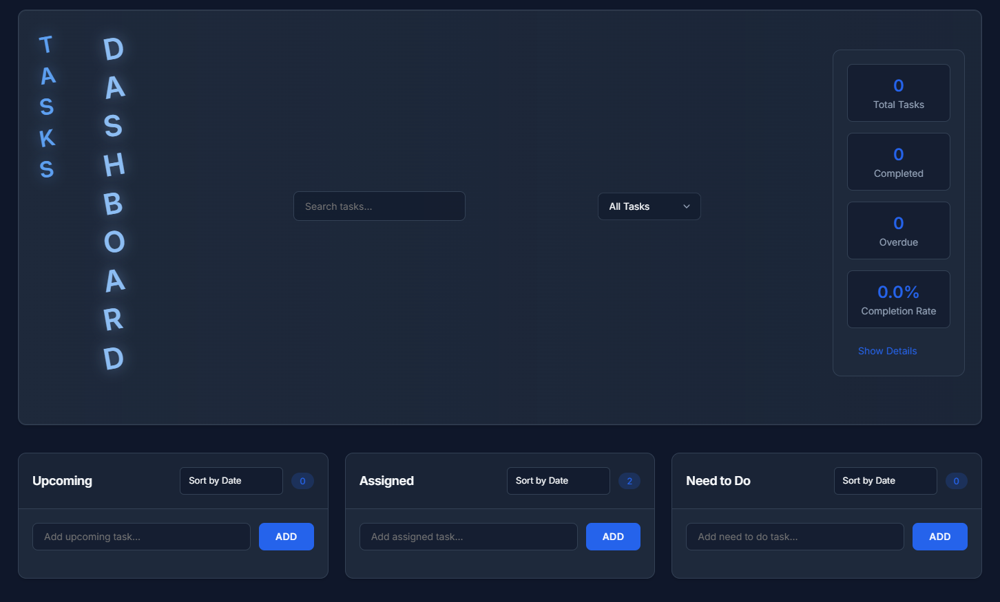

# Task Dashboard

A modern, responsive task management dashboard with a clean and intuitive interface. Built with vanilla JavaScript using a component-based architecture.

## Screenshot



## Features

- **Multiple Task Panels**
  - Upcoming Tasks
  - Assigned Tasks
  - Need to Do Tasks
  
- **Task Management**
  - Create tasks with detailed information
  - Edit and delete tasks
  - Add notes to tasks
  - Set priorities (Low, Medium, High)
  - Assign categories
  - Set due dates
  - Mark tasks as completed

- **Organization Features**
  - Drag and drop tasks between panels
  - Sort tasks by date, priority, or due date
  - Search functionality
  - Filter tasks (All, Completed, Active, Overdue)
  - Bulk actions for multiple tasks

- **Statistics**
  - Real-time task statistics
  - Completion rate tracking
  - Overdue task monitoring
  - Detailed breakdowns by priority and category

## Project Structure

```
├── components/
│   ├── Panel.js
│   ├── TodoItem.js
│   ├── StatisticsManager.js
│   ├── BulkActionsManager.js
│   ├── SearchManager.js
│   └── FilterManager.js
├── services/
│   └── TodoService.js
├── styles/
│   ├── main.css
│   ├── panel.css
│   └── todo-item.css
└── js/
    └── app.js
```

## Installation

1. Clone the repository:
```bash
git clone https://github.com/yourusername/task-dashboard.git
```

2. Navigate to the project directory:
```bash
cd task-dashboard
```

3. Open `index.html` in your browser or serve using a local server.

## Usage

### Creating Tasks
- Click the "Add" button in any panel
- Fill in task details:
  - Title
  - Description (optional)
  - Due date
  - Priority
  - Category

### Managing Tasks
- Drag tasks between panels
- Use the search bar to find specific tasks
- Filter tasks using the dropdown menu
- Sort tasks within each panel
- Use bulk actions for multiple tasks:
  - Complete all selected
  - Delete all selected
  - Set priority for all selected

### Keyboard Shortcuts
- `Ctrl/Cmd + K`: Focus search
- `Ctrl/Cmd + N`: Add new task

## Local Storage

The dashboard uses browser's local storage to persist tasks. Data is automatically saved when:
- Creating new tasks
- Editing tasks
- Moving tasks between panels
- Changing task status
- Adding notes

## Styling

The project uses custom CSS with:
- Dark theme
- Responsive design
- Smooth animations
- Clean, modern interface
- Custom scrollbars
- Interactive hover effects

## Browser Support

Supports all modern browsers including:
- Chrome
- Firefox
- Safari
- Edge

## Contributing

1. Fork the repository
2. Create your feature branch: `git checkout -b feature/your-feature`
3. Commit your changes: `git commit -m 'Add your feature'`
4. Push to the branch: `git push origin feature/your-feature`
5. Submit a pull request

## License

This project is licensed under the MIT License.
